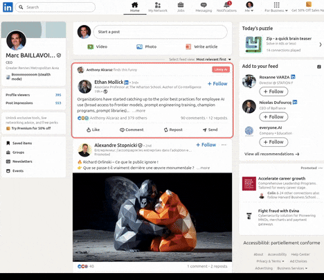

# AI Post Detector

Chrome extension that detects AI-generated posts on LinkedIn using local LLM via Ollama.



## Setup

1. Install [Ollama](https://ollama.com)
2. Pull a model: `ollama pull ministral-3:14b-cloud`
3. Load extension in Chrome: `chrome://extensions` → Developer mode → Load unpacked
4. Open LinkedIn and scroll

## Verdicts

- 🟢 **Human** / **Likely Human** - Authentic content
- 🟡 **Uncertain** - Mixed signals
- 🔴 **Likely AI** / **AI** - Synthetic patterns detected

## Structure

```
├── src/           # Extension source
├── icons/         # Extension icons
├── manifest.json  # Chrome config
└── CLAUDE.md      # Dev guide
```

## License

MIT
